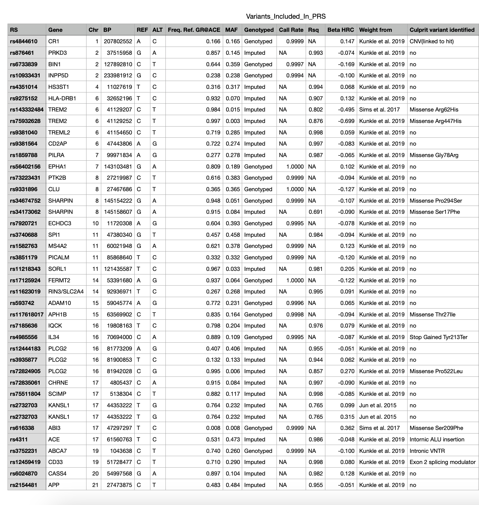

# Polygenic Risk Score Calculator for Alzheimer's Disease

A command-line tool written in R that calculates an individual's polygenic risk score (PRS) for late-onset Alzheimer's disease from a standard VCF file. The calculator uses published effect sizes from the largest Alzheimer's GWAS meta-analysis to date and returns an odds ratio indicating relative genetic risk.

## Background

**Polygenic Risk Scores** aggregate the small effects of many common genetic variants into a single number that estimates an individual's genetic predisposition to a disease. Unlike rare Mendelian mutations that cause early-onset Alzheimer's with near certainty, the common variants captured by a PRS each contribute modestly to risk. Their combined effect, however, can meaningfully stratify individuals along a spectrum of genetic susceptibility.

This calculator is based on the findings of:

> de Rojas, I., Moreno-Grau, S., Tesi, N. *et al.* Common variants in Alzheimer's disease and risk stratification by polygenic risk scores. *Nat Commun* **12**, 3417 (2021). https://doi.org/10.1038/s41467-021-22491-8

That study performed a large meta-analysis across multiple European-descent cohorts and identified 39 genomic loci (beyond *APOE*) associated with Alzheimer's disease, providing the effect-size weights used here.

## How It Works

1. **Extract SNPs** -- The script reads a patient's VCF file and looks up each of the 39+ Alzheimer's-associated SNPs (plus the two *APOE* variants rs429358 and rs7412).
2. **Count risk alleles** -- For each SNP found in the VCF, the genotype is converted to an allele count (0, 1, or 2 copies of the risk allele).
3. **Weighted sum** -- Each allele count is multiplied by the variant's beta coefficient (log odds ratio) from the GWAS summary statistics, and the products are summed to produce the PRS.
4. **Odds ratio** -- The PRS is exponentiated (`exp(PRS)`) to yield an odds ratio relative to the population average.

## SNPs Used

The calculator evaluates variants across 39 loci including genes such as *CR1*, *BIN1*, *TREM2*, *CLU*, *PICALM*, *SORL1*, *ABCA7*, and *ADAM10*, among others. Two additional *APOE* variants are included:

- **rs429358** (*APOE4*) -- the strongest common genetic risk factor for Alzheimer's
- **rs7412** (*APOE2*) -- associated with a protective effect

The full set of SNPs and their associated genes is shown below:



## Usage

### Prerequisites

- **R** (version 3.6 or later)
- R packages: `dplyr`, `stringr`, `vcfR` (installed automatically via `pacman`)

### Steps

1. **Clone the repository**

   ```bash
   git clone https://github.com/deepmind11/PRS-Calculator-Alzheimers-Disease.git
   cd PRS-Calculator-Alzheimers-Disease
   ```

2. **Download the GWAS summary statistics**

   Download the summary statistics file from the [original authors' SharePoint link](https://fundacioace-my.sharepoint.com/:u:/g/personal/iderojas_fundacioace_org/EaTwlPg9cRJHn7Kos4h39OUBaxajsjJHL_C110fC89bc8w?e=ZdcEUy) and save it as:

   ```
   data/Sumstats_SPIGAPUK2_20190625.txt
   ```

3. **Set the path to your VCF file**

   Open `PRScalculator.R` and replace the placeholder on line 11 with the path to your VCF file:

   ```r
   vcf <- read.vcfR("/path/to/your/sample.vcf")
   ```

4. **Run the script**

   ```bash
   Rscript PRScalculator.R
   ```

## Input

The calculator expects a standard **VCF (Variant Call Format)** file containing at least the SNP rsIDs in the ID column and genotype information (GT field) for a single sample. Whole-genome sequencing, whole-exome sequencing, or genotyping array VCFs are all compatible, provided the relevant Alzheimer's-associated variants are present.

## Output

The script prints:

- The number of Alzheimer's-associated SNPs found in the VCF
- The list of matching SNP rsIDs and their genotypes
- The **odds ratio (OR)** for Alzheimer's disease

### Interpreting the Odds Ratio

| Odds Ratio | Interpretation |
|---|---|
| OR = 1.0 | Average population risk |
| OR = 1.5 | 50% higher genetic risk than the population average |
| OR = 0.7 | 30% lower genetic risk than the population average |
| OR = 3.0 | 3x the average genetic risk |

The odds ratio reflects relative genetic risk only. It does not account for age, sex, lifestyle, comorbidities, or other non-genetic factors.

## Limitations

- **Ancestry-specific**: The GWAS weights were derived from European-descent cohorts. Applying this calculator to individuals of other ancestries may produce inaccurate or misleading results.
- **Not clinical-grade**: This tool is intended for **research and educational purposes only**. It has not been validated for clinical diagnosis or medical decision-making.
- **Incomplete variant coverage**: If a VCF lacks some of the queried SNPs (e.g., from a targeted genotyping array), the PRS will be computed from the available subset, which reduces its predictive power.
- **No environmental factors**: The PRS captures genetic risk only and does not incorporate age, family history, biomarkers, or lifestyle factors.

## Data Sources

| File | Description |
|---|---|
| `data/Genetic_Landscape_of_AD.tsv` | Comprehensive table of 42 Alzheimer's-associated loci with chromosomal positions, effect directions, discovery studies, nearest genes, and culprit variant annotations. |
| `data/Meta_GWAS_Case-control_AD-by-proxy.tsv` | Meta-analysis results (case-control and AD-by-proxy combined) listing odds ratios with 95% confidence intervals and p-values for each variant. |
| `data/Variants_Included_In_PRS.tsv` | The specific variants used in PRS calculation with reference/alternate alleles, allele frequencies, imputation quality, beta coefficients, and weight sources. |
| `data/Sumstats_SPIGAPUK2_20190625.txt` | Full GWAS summary statistics (must be downloaded separately; see Usage above). Provides the beta coefficients used as PRS weights. |

## Citation

If you use this calculator in your work, please cite the underlying study:

> de Rojas, I., Moreno-Grau, S., Tesi, N. *et al.* Common variants in Alzheimer's disease and risk stratification by polygenic risk scores. *Nat Commun* **12**, 3417 (2021). https://doi.org/10.1038/s41467-021-22491-8

## License

This project is licensed under the [MIT License](LICENSE).
